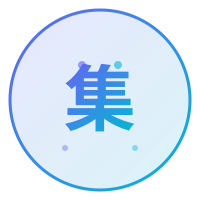

<p align="center">
  
</p>

<h1 align="center">集品 · Ji Pin</h1>

<p align="center">
  <b>收集品质好物，分享AI智慧</b><br/>
  <i>Curating quality AI tools, knowledge & prompts</i>
</p>

<p align="center">
  <a href="https://github.com/jipin-ai/ji_pin/blob/main/LICENSE">
    
  </a>
  <a href="https://github.com/jipin-ai/ji_pin/stargazers">
    
  </a>
  <a href="https://github.com/jipin-ai/ji_pin/actions">
    
  </a>
  
  
  
</p>

---

## 📦 项目导览

| # | 项目 | 说明 | 状态 |
|---|------|------|------|
| 🤖 | [飞书AI机器人](feishu-ai-bot/) | 智能对话 / AI绘图 / 群聊总结 / 周报生成 | 🚧 构建中 |
| 📖 | [集品笔记](notes/) | AI学习笔记与技术知识库（VitePress） | 📝 写作中 |
| 🗃️ | [AI Prompt 库](awesome-prompts/) | 精选高质量中文AI提示词 | 📚 收集中 |

---

## 📊 仓库动态

<p align="center">
  
</p>

---

## 🎯 关于集品

**集品 (jí pǐn)** — "集"是收集，"品"是品质。

这里汇聚了我对 AI 的热爱与探索：
- 🤖 让飞书群拥有 AI 超能力
- 📝 记录 AI 学习路上的思考
- 💡 整理那些好用的 Prompt

---

## 🚀 快速开始

```bash
# 克隆仓库
git clone git@github.com:jipin-ai/ji_pin.git
cd ji_pin

# 进入飞书机器人项目
cd feishu-ai-bot
pip install -r requirements.txt
```

查看各子目录 README 获取详细指引。

---

## 🤝 贡献 & 联系

- 📬 提交 [Issue](https://github.com/jipin-ai/ji_pin/issues) 反馈建议
- 🔀 欢迎 PR & Star ⭐
- 🌐 [https://capsule.top](https://capsule.top)

---

<p align="center">
  
  <br/>
  Made with ❤️ by <a href="https://github.com/jipin-ai">jipin-ai</a>
</p>
