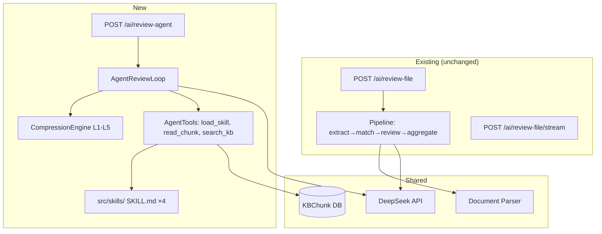
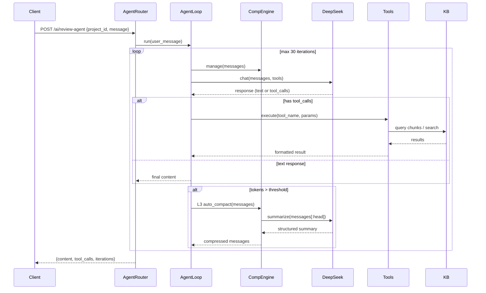

# Compression Agent Integration — Design

## 1. Architecture Overview



## 2. File Structure Plan

```
src/compliance/
├── compression_engine.py    # [COPIED] 302行，from /root/compression_engine/
├── agent_loop.py            # [NEW] AgentReviewLoop class
├── agent_tools.py           # [NEW] ToolBase + tool implementations
├── agent_router.py          # [NEW] FastAPI router for agent endpoints
├── pipeline.py              # [UNCHANGED] Existing 4-stage pipeline
├── ai_reviewer.py           # [UNCHANGED] Legacy single-call review
└── router.py                # [PATCHED] Register agent_router

src/skills/                   # [NEW]
├── 政府采购法实施条例/
│   └── SKILL.md
├── 招标投标法/
│   └── SKILL.md
├── 政府采购法/
│   └── SKILL.md
└── 招标投标法实施条例/
    └── SKILL.md

src/parsing/
└── chunker.py               # [NEW] Document chunker for 100MB+ files

src/config.py                 # [PATCHED] Add compression params
src/main.py                   # [PATCHED] Version bump + agent router
```

## 3. Component Interfaces

### 3.1 AgentReviewLoop (`agent_loop.py`)

```python
class AgentReviewLoop:
    """Multi-turn agent review with tools and 5-layer compression."""
    
    def __init__(
        self,
        settings: Settings,
        project_id: int,
        bid_chunks: list[KBChunk],     # Pre-loaded bid document chunks
        compression_engine: CompressionEngine | None = None,
        max_iterations: int = 30,
    ):
        ...
    
    async def run(self, user_message: str) -> dict:
        """Run agent loop. Returns {content, tool_calls, iterations, run_dir}."""
    
    async def continue_session(self, user_message: str) -> dict:
        """Continue existing session."""
```

### 3.2 AgentTools (`agent_tools.py`)

```python
class ToolBase:
    name: str
    description: str
    parameters: dict        # JSON Schema

class LoadSkillTool(ToolBase):
    """Load SKILL.md by name → full markdown content."""
    async def execute(self, name: str) -> str

class ReadChunkTool(ToolBase):
    """Read a chunk from the bid document by index."""
    async def execute(self, doc_id: int, chunk_index: int) -> str

class SearchKBTool(ToolBase):
    """Semantic search in knowledge base chunks."""
    async def execute(self, query: str, top_k: int = 5) -> str
```

### 3.3 Document Chunker (`chunker.py`)

```python
def chunk_document(parsed: ParsedDocument, chunk_size: int, overlap: int) -> list[dict]:
    """Split a parsed document into chunks with embeddings.
    Returns [{content, heading, section_id, page_number, chunk_index, embedding}].
    """
```

## 4. Data Flow



## 5. API Design

### POST /ai/review-agent

```json
// Request
{
  "project_id": 1,
  "message": "请审核这份标书的技术合规性，重点关注安全要求",
  "session_id": null  // null = new session
}

// Response
{
  "content": "## 技术合规性审核\n\n...",
  "tool_calls": [
    {"tool": "load_skill", "args": {"name": "招标投标法"}, "result_preview": "..."},
    {"tool": "read_chunk", "args": {"doc_id": 1, "chunk_index": 5}}
  ],
  "iterations": 4,
  "session_id": "agent-sess-abc123",
  "compression_stats": {
    "l1_applied": 4,
    "l3_applied": 0,
    "peak_tokens": 8500
  }
}
```

### POST /ai/review-agent/continue

```json
// Request
{
  "session_id": "agent-sess-abc123",
  "message": "安全认证部分有什么问题？"
}

// Response: same format as above, continues the session
```

## 6. Database

**No schema changes.** Reuses:

| Table | Use |
|-------|-----|
| `kb_chunks` | Bid document chunks (uploaded via existing flow) |
| `kb_documents` | Bid documents tracked as KB entries |

New internal use only — the existing KB upload pipeline (`POST /admin/kb/upload`) already chunkifies and embeds. The agent's `read_chunk` tool reads from `kb_chunks` directly.

## 7. Compression Parameters (100MB+ Scenario)

Located in `src/config.py` and overridable via env:

```python
# Compression Engine — tuned for 100MB+ bid documents
COMPRESSION_TOKEN_THRESHOLD: int = 40000      # L3 trigger
COMPRESSION_TAIL_BUDGET: int = 30000          # Tail protection
COMPRESSION_KEEP_RECENT: int = 5              # L1 preserve count
COMPRESSION_COLLAPSE_TEXT_MIN: int = 5000     # L2 min text size
COMPRESSION_COLLAPSE_HEAD: int = 1500         # L2 head chars
COMPRESSION_COLLAPSE_TAIL: int = 1000         # L2 tail chars
COMPRESSION_MAX_ITERATIONS: int = 30          # Agent loop limit
COMPRESSION_CHUNK_SIZE: int = 2000            # Doc chunk tokens
COMPRESSION_CHUNK_OVERLAP: int = 50           # Chunk overlap tokens
```

## 8. Design Decisions

| Decision | Rationale | Rejected Alternative |
|----------|-----------|---------------------|
| Copy compression engine (don't import) | Engine is standalone; BidSmart shouldn't depend on /root/compression_engine/ | pip package (overkill for 302 lines) |
| New agent mode, keep pipeline | Pipeline handles batch review well; agent handles multi-turn | Full rewrite (too risky, breaks existing) |
| Reuse KBChunk for doc chunks | No schema migration needed; BGE-M3 embeddings already generated | New table (adds complexity) |
| No frontend changes | Minimize scope; agent mode tested via API | Full UI (separate spec later) |
| AsyncOpenAI (same client as pipeline) | Consistent auth/config; no new dependencies | httpx/aiohttp (redundant) |
| L1 always on, L3 on threshold | Zero-cost L1 is always beneficial; L3 has API cost | L1 optional (adds config burden) |
