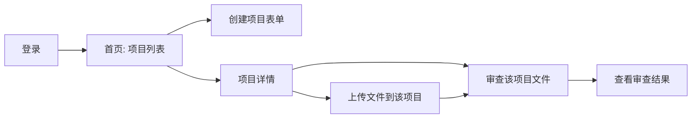
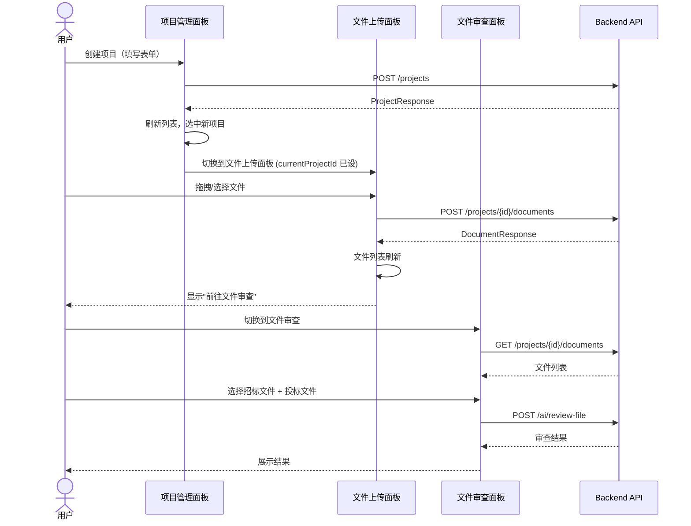

# project-management-ux — 设计文档

## 1. 架构概览

本 feature 是纯前端重构 + 已有后端 API 的前端接入。后端已就绪。

```mermaid
flowchart TB
    subgraph 前端[Frontend SPA]
        PM[项目管理面板]
        UP[文件上传面板]
        FR[文件审查面板]
        CHAT[AI会话面板]
    end
    
    subgraph API[Backend API - 已有]
        AUTH[/auth/*]
        PROJ[/projects/*]
        DOCS[/projects/{id}/documents]
        AI[/ai/*]
    end
    
    PM -->|创建/列表| PROJ
    UP -->|上传文件| DOCS
    UP -->|获取项目| PROJ
    FR -->|列出文件| DOCS
    FR -->|获取项目| PROJ
    FR -->|审查| AI
```

## 2. UI 导航重构

**当前:** 三个 Tab 平级（文件上传 / 手动输入 / 文件审查）

**改为:** 以项目为中心的两级导航



Tab 结构：
| Tab | 作用 | 依赖 |
|-----|------|------|
| 📁 项目管理 | 项目列表 + 创建表单 | GET/POST /projects |
| 📄 文件上传 | 项目内文件上传 | GET /projects/{id}/documents, POST 上传 |
| 📊 文件审查 | 从项目选文件 → AI审查 | GET /projects/{id}/documents, POST /ai/review-file |

## 3. 文件结构计划

所有改动限于 `static/index.html`。文件结构：
```
static/
└── index.html    ← 唯一改动文件（前端SPA）
```

后端无需改动（API 已在之前补全）。

## 4. 组件接口

### 4.1 项目创建表单
```javascript
// HTML 区域: #projectCreateForm (在项目管理面板内)
// 字段:
//   name: string (required) — 项目名称
//   department: string — 投标部门
//   editor: string — 投标书编辑人  
//   bid_time: date — 投标时间

// API: POST /projects
// Request: { name, description, department, editor, bid_time }
// Response: ProjectResponse

// 操作流:
// 填写 → 提交 → API → 成功 → 刷新列表 + 自动选中新项目 → 切换到文件上传面板
```

### 4.2 项目列表（带上下文切换）
```javascript
// HTML 区域: #projectList (在项目管理面板内)
// 每个项目显示: 名称、部门、文件数、创建时间
// 点击 → 设置 currentProjectId → 切换到文件上传面板
// 高亮当前选中项目

// API: GET /projects?page=1&page_size=50
// Response: PaginatedResponse<ProjectResponse>
```

### 4.3 文件上传面板（项目上下文）
```javascript
// HTML 区域: #uploadPanel (保持)
// 进入时若 currentProjectId 已设置 → 显示项目名 + 跳过项目选择
// 若未设置 → 提示"请先在项目管理中选择项目"
// 上传区域仅关联当前项目
// 上传完成后显示"前往文件审查"按钮

// API: POST /projects/{currentProjectId}/documents
// API: GET /projects/{currentProjectId}/documents (刷新文件列表)
```

### 4.4 文件审查面板（项目文件选择）
```javascript
// HTML 区域: #fileReviewPanel (保持)
// 下拉框改为级联: 先选项目 → 再选文件
// 或: 直接使用 currentProjectId，加载该项目的文件

// 方案A (级联): 选项目 → 加载文件 → 选文件 → 审查
// 方案B (当前项目): 直接用 currentProjectId，两个下拉框列出该项目文件

// 采用方案B: 更简洁。若 currentProjectId 未设置，先回项目管理选项目。

// API: GET /projects/{currentProjectId}/documents
// API: POST /ai/review-file
```

## 5. 数据流



## 6. 设计决策

| 决策 | 方案 | 理由 |
|------|------|------|
| 导航结构 | 三级Tab保留，加项目上下文 | 避免重写整个UI，改动最小 |
| 文件审查选文件 | 直接用 currentProjectId | 比级联选择少一次操作 |
| 前端框架 | 继续纯 HTML/CSS/JS | 满足约束，改动范围可控 |
| 项目上下文传递 | 全局 JS 变量 `currentProjectId` | 简单直接，单页面无需路由 |
| 进度反馈 | 简单文字状态 | 大文件上传不做精确进度条（需要分块上传支持） |
| 文件列表刷新 | 上传后自动 `loadProjectFiles()` | 避免用户手动刷新 |

## 7. 状态管理

```javascript
// 全局状态
let currentProjectId = null;  // 当前选中的项目ID
let currentProject = null;    // 当前项目对象

// 生命周期
// 登录后 → loadProjects() → 若无项目则展示"创建第一个项目"
// 创建项目 → setCurrentProject(id) → 切换到上传面板
// 选中项目 → setCurrentProject(id) → 刷新上传面板 + 高亮项目
// 文件审查 → 使用 currentProjectId 加载文件列表
```
