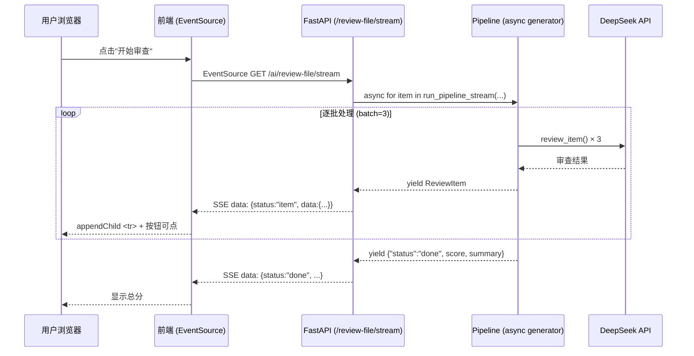

# streaming-review — 设计文档

## 1. 架构概览



## 2. 文件结构

```
src/compliance/
├── pipeline.py          # 新增 run_pipeline_stream() async generator
├── router.py            # 改写 /review-file/stream，消费 generator
static/
└── index.html           # 新增 EventSource 监听，逐行追加逻辑
```

不改其他文件。`run_pipeline()` （非流式）保留不动。

## 3. 组件接口

### 3.1 run_pipeline_stream() (新增)

```python
async def run_pipeline_stream(
    tender_docs: list[Document],
    bid_docs: list[Document],
    db: AsyncSession,
    settings: Settings,
) -> AsyncGenerator[dict, None]:
    """
    与 run_pipeline() 逻辑相同，但改为 async generator。
    每批审查完成后 yield 单条 item dict，最后 yield done。
    
    Yields:
        {"status": "item", "data": <review_item_dict>}
        {"status": "done", "score": float, "summary": {...}}
        {"status": "error", "message": str}
    """
```

### 3.2 /review-file/stream 端点 (改写)

```python
@router.post("/review-file/stream")
async def ai_review_file_stream(req: ReviewFileRequest, ...):
    async def generate():
        # 1. 加载文档（与当前逻辑相同）
        tender_docs, bid_docs = await _load_docs(...)
        
        # 2. 发送进度状态
        yield f"data: {json.dumps({'status':'parsing'})}\n\n"
        
        # 3. 流式产出
        async for event in run_pipeline_stream(tender_docs, bid_docs, db, settings):
            yield f"data: {json.dumps(event)}\n\n"
    
    return StreamingResponse(generate(), media_type="text/event-stream")
```

### 3.3 前端 EventSource (新增)

```javascript
// 替换 startFileReview() 中的 fetch 调用
let reviewEventSource = null;

function startStreamingReview(tenderDocIds, bidDocIds, projectId) {
    // 显示审查中状态，清空对照表 tbody
    const tbody = document.querySelector('#compareTable tbody');
    tbody.innerHTML = '';
    
    // 构建 URL（POST 无法用 EventSource，改用 POST + ReadableStream）
    fetch('/ai/review-file/stream', {
        method: 'POST',
        headers: {'Content-Type': 'application/json', 'Authorization': `Bearer ${token}`},
        body: JSON.stringify({tender_doc_ids: tenderDocIds, bid_doc_ids: bidDocIds, project_id: projectId})
    }).then(async response => {
        const reader = response.body.getReader();
        const decoder = new TextDecoder();
        let buffer = '';
        
        while (true) {
            const {done, value} = await reader.read();
            if (done) break;
            buffer += decoder.decode(value, {stream: true});
            
            // 解析 SSE 行
            const lines = buffer.split('\n');
            buffer = lines.pop() || '';
            
            for (const line of lines) {
                if (line.startsWith('data: ')) {
                    const event = JSON.parse(line.slice(6));
                    if (event.status === 'item') {
                        appendCompareRow(event.data);
                    } else if (event.status === 'done') {
                        showReviewScore(event.score, event.summary);
                    }
                }
            }
        }
    });
}

function appendCompareRow(item) {
    const tbody = document.querySelector('#compareTable tbody');
    const tr = document.createElement('tr');
    // 权重行样式
    tr.className = `row-${item.weight_level || 'amber'}`;
    // ... 构建 td 内容（复用 buildCompareTable 的行模板逻辑）
    tbody.appendChild(tr);
}
```

## 4. 数据流

```
前端 fetch(POST /review-file/stream)
  → ReadableStream reader
  → 解析 SSE data: 行
  → status:"item" → appendCompareRow() → DOM insert
  → status:"done" → showReviewScore()
```

注意：EventSource 不支持 POST + headers (Authorization)，改用 `fetch + ReadableStream` 方案。语义与 SSE 一致（text/event-stream），但支持 POST。

## 5. 设计决策

| 决策 | 选择 | 理由 |
|------|------|------|
| 推送方式 | SSE (ReadableStream) | POST 需要传参+认证，EventSource 不支持 POST |
| 管道结构 | async generator | 最小改动，原 pipeline 逻辑复用 |
| 前端追加方式 | appendChild | 不破坏已有 DOM，不闪烁 |
| 权重排序 | 后端排好再推 | 前端按接收顺序追加即可，无需客户端排序 |
| 非流式端点 | 保留不动 | 向后兼容 |

### 不选 WebSocket
- 开销大：需要握手、心跳、双向管理
- 本场景只需 server→client 单向推送，SSE 足够

### 不选 Polling
- 增加延迟和 HTTP 开销
- 需要额外状态管理（检查新条目）
