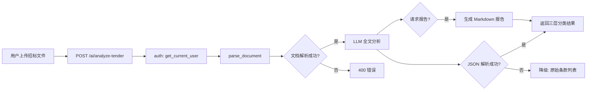
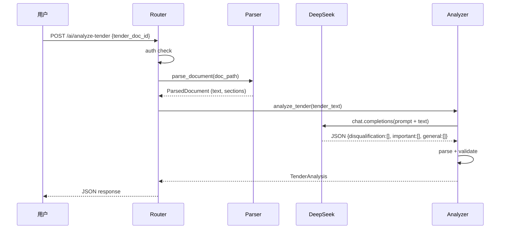

# 标前招标分析 — 架构设计

## 1. 架构概览



## 2. 文件结构

```
src/compliance/
├── tender_analyzer.py    ← [新增] 核心分析逻辑
├── router.py             ← [修改] 新增 /analyze-tender 端点
├── pipeline.py           ← [不变]
├── ai_reviewer.py         ← [不变]
└── ...

.sdd/specs/tender-analysis/
├── brief.md
├── spec.json
├── requirements.md
├── design.md
└── tasks.md              (下一步)
```

## 3. 组件接口

### 3.1 `tender_analyzer.py` — 核心分析函数

```python
from dataclasses import dataclass

@dataclass
class TenderItem:
    text: str           # 条款原文
    category: str       # disqualification | important | general
    reason: str         # 分类理由
    section: str        # 所属章节
    risk: str           # 风险提示

@dataclass
class TenderAnalysis:
    disqualification: list[TenderItem]
    important: list[TenderItem]
    general: list[TenderItem]
    summary: str        # AI 生成的总体建议
    total_count: int    # 提取条款总数

async def analyze_tender(
    tender_text: str,
    settings: Settings,
    client: AsyncOpenAI | None = None,
) -> TenderAnalysis:
    """全文一次性分析招标要求，三层分类返回。"""
```

### 3.2 Router — 端点定义

```python
# 输入方式一：已上传文档 ID
class AnalyzeRequest(BaseModel):
    tender_doc_id: int

# 输入方式二：直接上传文件
@router.post("/analyze-tender")
async def analyze_tender_endpoint(...): ...

@router.post("/analyze-tender/upload")
async def analyze_tender_upload(file: UploadFile, ...): ...
```

### 3.3 降级逻辑

```python
def _degraded_analysis(requirements: list[str]) -> TenderAnalysis:
    """LLM 失败时：返回原始条款列表，全部标记为 general。"""
    items = [TenderItem(text=r, category="general", reason="自动提取", section="", risk="") 
             for r in requirements]
    return TenderAnalysis(disqualification=[], important=[], general=items,
                          summary="LLM 分析失败，以下为自动提取的招标条款列表。请人工分类。",
                          total_count=len(items))
```

## 4. 数据流



## 5. API 设计

### POST /ai/analyze-tender
```json
// Request
{ "tender_doc_id": 42 }

// Response 200
{
  "disqualification": [
    {
      "text": "投标保证金金额：人民币50万元",
      "reason": "未缴纳直接废标",
      "section": "第二章 投标人须知 3.4.1",
      "risk": "必须于投标截止前到账"
    }
  ],
  "important": [
    {
      "text": "项目经理需具有一级注册建造师资格",
      "reason": "资格审查核心条款",
      "section": "第三章 评标办法 2.1.2",
      "risk": "不满足则资格审查不通过"
    }
  ],
  "general": [
    {
      "text": "投标文件正本1份，副本4份",
      "reason": "格式要求",
      "section": "第二章 投标人须知 3.7.3",
      "risk": ""
    }
  ],
  "summary": "本招标文件共提取156条要求。其中废标项12条，重要条款47条，一般条款97条。编写投标书时优先确保废标项和重要条款全覆盖。",
  "total_count": 156,
  "report_markdown": "# 招标文件分析报告\n..."
}
```

## 6. Prompt 设计

```
你是标书智审的招标文件分析引擎。分析以下招标文件，提取所有评审要求，按三层分类。

## 分类标准

### 🔴 废标项
缺失直接导致废标的条款。包括但不限于：
- 投标保证金（金额、截止日、形式）
- 资质证书（有效期、等级）
- 投标函签字盖章要求
- 投标有效期
- 实质性响应条件

### 🟡 重要条款
评审分值占比高（≥5分）或技术核心要求：
- 项目经理/技术负责人资格
- 类似项目业绩
- 技术方案核心要求
- 工期/质量承诺

### 🟢 一般条款
格式、装订、基础信息类：
- 文件装订方式
- 页码格式
- 目录要求
- 一般性承诺

## 输出格式
严格返回 JSON:
{
  "disqualification": [
    {"text": "条款原文", "reason": "分类理由", "section": "所在章节", "risk": "具体风险"}
  ],
  "important": [...],
  "general": [...],
  "summary": "总体建议（150字内）"
}

原则：
1. 不漏任何条款
2. 分类从宽（不确定时降低一级）
3. 废标项务必精确（宁缺毋滥）
```

## 7. 设计决策

| 决策 | 选择 | 拒绝方案 | 理由 |
|------|------|---------|------|
| 分析策略 | 全文一次性 LLM | 逐条 LLM 分类 | 逐条 ≈514次API，太贵。全文一次性用上下文理解关联性更准 |
| 输出格式 | JSON | 纯文本/CSV | 便于程序化使用和前端展示 |
| 报告格式 | Markdown | Word/PDF | MVP 不引入文档生成库，Markdown 可复制到飞书 |
| 降级策略 | 全部标记 general | 返回错误 | 提供部分价值优于完全失败 |
| 文本截断 | 前8000 tokens | 全文 | 超长招标文件（>40万字符）的 LLM 上下文限制 |
| 文件位置 | `src/compliance/tender_analyzer.py` | 新建独立模块 | 与审查逻辑紧密相关，放在同目录下 |
